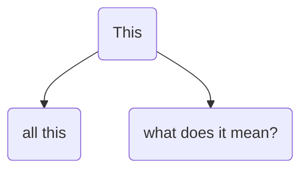
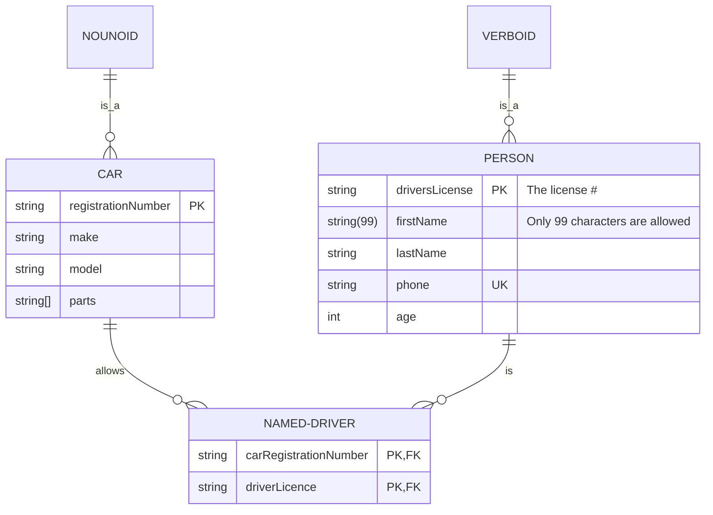

# factual.semantics

The hidden shapes of intelligence, bridging the natural and the artificial in semantically symbolic entity relationship models. 

The Jupyter notebook example [auto_taxonomy](auto_taxonomy.ipynb) generates a language model and knowledge graph of a "mindfulness" article and the relevant UMLS concepts.  

Messing around with mermaid ...
