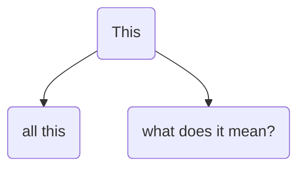
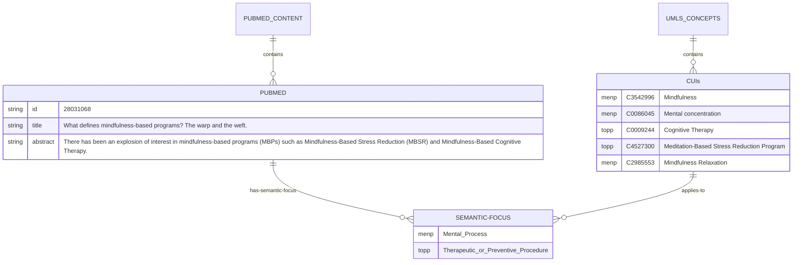

# factual.semantics

The hidden shapes of intelligence, bridging the natural and the artificial in semantically symbolic entity relationship models. 

The Jupyter notebook example >>>  [auto_taxonomy](auto_taxonomy.ipynb) <<< generates a minimal language model and knowledge graph of a "mindfulness" article and the relevant UMLS concepts.  Semantic alignment separates the meaningful concepts from the noise in entity recognition. The resulting data is diagramed like so: 

